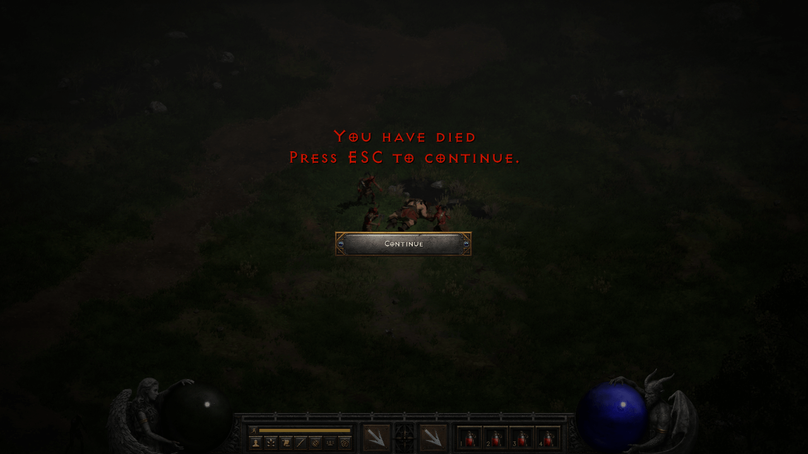

<h1 align="center">Koolo</h1>

---

Koolo is a small bot for Diablo II: Resurrected. Koolo project was built for informational and educational purposes
only, it's not intended for online usage. Feel free to contribute opening pull requests with new features or bugfixes.

## Disclaimer

Can I get banned for using Koolo? The answer is a crystal clear yes, you can get banned although at this point I'm
not aware of any ban for using it. I'm not responsible for any ban or any other consequence that may arise from it.

## How it works

Koolo reads game memory and interacts with the game simulating clicks/keystrokes.
It uses the following third party libraries:

- https://github.com/joffreybesos/rustdecrypt
- https://github.com/hectorgimenez/d2go
- https://github.com/hectorgimenez/diablo2 (forked
  from [blacha's repo](https://github.com/blacha/diablo2/tree/master/packages/map))

## Requirements

- Diablo II: Resurrected
- Diablo II: LOD 1.13c (required by https://github.com/blacha/diablo2/tree/master/packages/map)

## Quick Start

Koolo will be clicking, moving the mouse, pressing keys... Basically this makes the computer unusable while running the
bot. It's recommended to run it on a [virtual machine](https://github.com/jamesstringerparsec/Easy-GPU-PV).

- If you haven't done yet, install Diablo II: LOD 1.13c
- Edit `config/config.yaml` and ensure `D2LoDPath` is pointing to your Diablo II: LOD 1.13c installation directory.
- Run d2.install.reg to install the required registry key.
- Configure custom bot settings under `config/config.yaml` and `config/pickit/*.nip` files for pickit rules.
- Open Diablo II: Resurrected and ensure the game resolution is set to 1280x720 or 1920x1080 in HiDPI mode.
- Enter the game with your character.
- Run `koolo.exe`.
- It should start the configured runs. You can pause/resume execution with ```,``` or stop it with ```.``` keys

## Features

- Blizzard Sorceress and Hammerdin are currently supported
- Supported runs: Countess, Andariel, Ancient Tunnels, Summoner, Mephisto, Council, Eldritch, Pindleskin, Nihlathak,
  Tristram, Lower Kurast, Baal (WIP), Diablo (WIP)
- Bot integration for Discord and Telegram
- "Companion mode" one leader bot will be creating games and the rest of the bots will join the game... and sometimes it
  works
- Pickit based on NIP files
- Auto potion for health and mana (also mercenary)
- Chicken when low health
- Inventory slot locking
- Revive mercenary
- CTA buff and class buffs
- Auto repair
- Skip on immune

## Development environment

Setting the development environment is pretty straightforward, but MinGW is **required** to build the project.

### Dependencies

- Download [MingGW](https://sourceforge.net/projects/mingw-w64/files/) ```x86_64-win32-seh``` should be fine, extract it
  and add it to the system PATH on Windows environment variables. For example if extracted in ```C:\mingw64``` add
  ```C:\mingw64\bin``` to the PATH. [Robotgo](https://github.com/go-vgo/robotgo) dependency requires MinGW to build.
- [Download Go >= 1.20](https://go.dev/dl/)
- [Install git](https://gitforwindows.org/)

```
git clone https://github.com/hectorgimenez/koolo.git
cd koolo
go run cmd/koolo/main.go
```

To produce a .exe build and prepare all the assets, the ```build.bat``` script can be used.
